# ColorTower

> - **Жанр:** tower defense
> - **Дата создания:** декабрь 2022
> - **Навыки:** `Level Design` `Coroutines` `UI` `Adobe Illustrator` `Adobe Photoshop`

<a href="https://cluttermultiname.itch.io/colortower" style="font-size: 200%;">Itch.io (web и ПК версии)</a>

<a href="https://www.youtube.com/watch?v=Ls5JrlN60_Y" style="font-size: 200%;">Демонстрационное видео</a>

<a href="https://github.com/Multiname/ColorTower" style="font-size: 200%;">Репозиторий</a>

## Описание
Как и в других играх жанра tower defense, в **ColorTower** игроку предстоит **строить башни**, чтобы защищать главное здание от **волн надвигающихся врагов**. **Ключевой особенностью** игры является возможность **соединять друг с другом находящиеся рядом башни**, чтобы окрашивать их в новые **цвета** и эффективнее уничтожать противников.

**Цвета** в игре делятся на **3 группы**. Игрок может **строить** башни с цветами лишь **первой группы**:

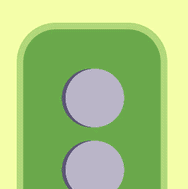

Чтобы получить цвета **второй** и **третьей группы**, необходимо **соединить** соседние башни с нужными цветами **первой** группы:

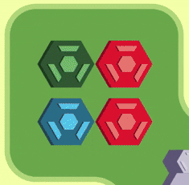

Цвета **второй группы**:

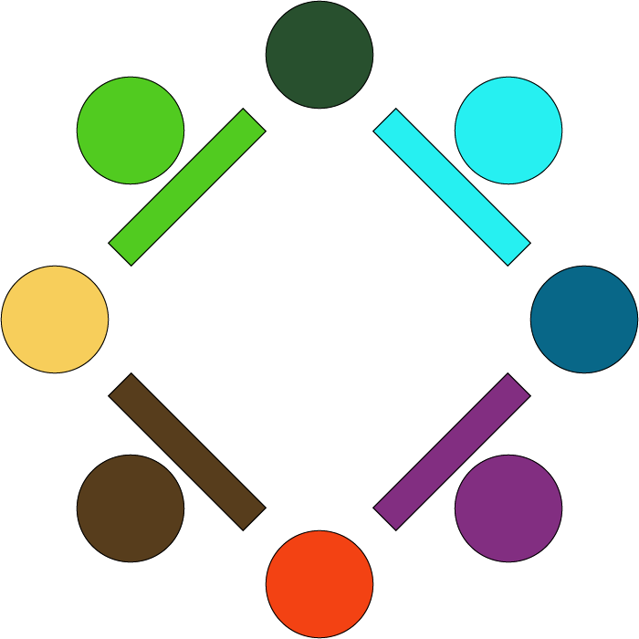

Цвета **третьей группы**:

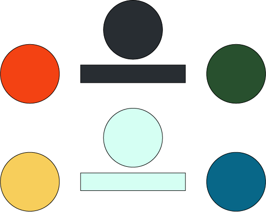

Башня может **наносить урон** противнику только в том случае, если его цвет находится **в той же группе**, что и цвет самой башни - например, фиолетовый враг (вторая группа) получает урон от коричневых башен (вторая группа), но не от желтых (первая группа):

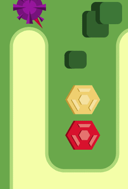

Также от цветов башни и врага зависит, будет ли башня наносить **больше** урона или **меньше** - например, зеленая башня наносит повышенный урон по желтым врагам и пониженный по синим:

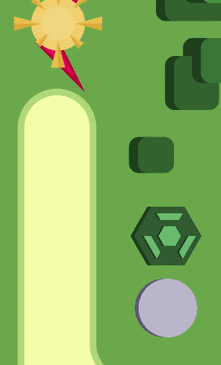
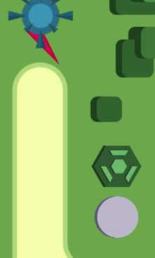

 

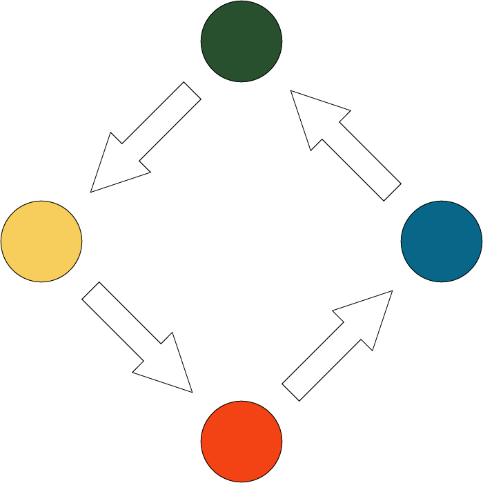

 

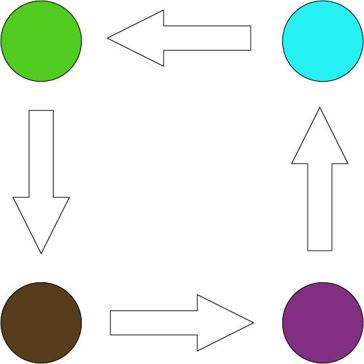

 

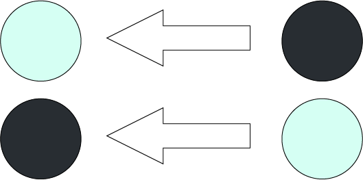

 

Таким образом, чтобы эффективно обороняться от волн противников, игроку необходимо в реальном времени **соединять башни** нужных цветов, а также заранее **планировать расположение** башен.

За уничтожение врагов игрок получает **монеты**, которые он может тратить, чтобы **строить новые башни** и **улучшать урон** или **радиус атаки** у существующих башен.

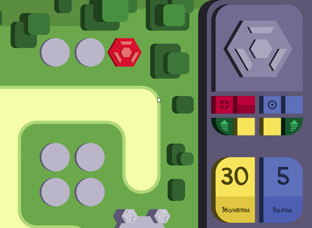

Перед каждой волной игра показывает, какие **противники** будут присутствовать в **следующей волне**. **Порядок** появления противников на поле **случайный**.

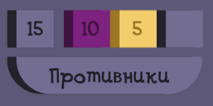

## О разработке
Работа над проектом происходила в рамках **курсовой работы** для бакалавриата, а сам проект в целом является одной из первых полноценно разработнных игр и пробой пера.

Так как в качестве визуального стиля был выбран **векторный стиль**, работа над спрайтами проходила в **Adobe Illustrator**. **Анимацией** врагов занимался в **Adobe Photoshop**. Механики игры достаточно просты, поэтому в коде можно отметить лишь применение **асинхронности** в виде **корутин**.