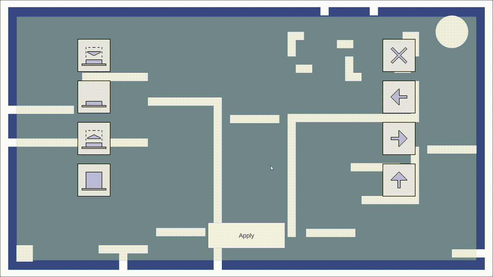
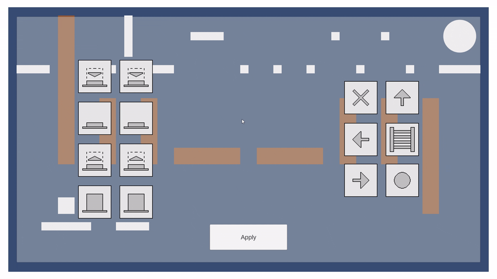
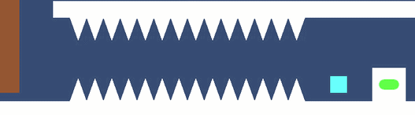

# OneButtonQuest

> - **Жанр:** платформер-головоломка
> - **Дата создания:** март 2025

<a href="https://cluttermultiname.itch.io/onebuttonquest" style="font-size: 200%;">Itch.io (web и ПК версии)</a>

<a href="https://www.youtube.com/watch?v=U1m-Wypl6iY" style="font-size: 200%;">Демонстрационное видео</a>

<a href="https://github.com/Multiname/OneButtonQuest" style="font-size: 200%;">Репозиторий</a>

## Описание
Главной особенностью платформера **OneButtonQuest** является **управление**, построенное вокруг всего **одной левой кнопки мыши**. С кнопкой можно совершать **4 действия**:
1. Нажимать
2. Удерживать
3. Отжимать
4. Оставлять отжатой

И на каждое из этих **"физических" действий** можно назначать различные **"игровые" действия**: движение вправо, прыжок, активация кнопок, атака и т.д.

Таким образом, игроку предоставляется **18 уровней**, где он должен определить подходящие **настройки управления** и с их помощью **добраться до портала**.

Уровни построены так, чтобы на каждом из них появлялась **новая механика**:
1. Базовое перемещение (движение влево и вправо, прыжки)

2. Лифты

3. Лестницы

4. Нажимные плиты

5. Кнпоки

6. Две схемы управления, которые чередуются друг с другом после каждого нажатия

7. Наносящие урон шипы

8. Подвижные враги

9. Ближняя атака

10. Враги, защищенные от ближних атак

11. Дальняя атака

12. Переключатели схем управления

13. Враги, защищенные от дальних атак

14. Патроны для дальней атаки

15. Кнопки, по которым надо выстрелить

16. Стреляющие враги

17. Неуязвимость

18. Задействие всех механик

## О разработке