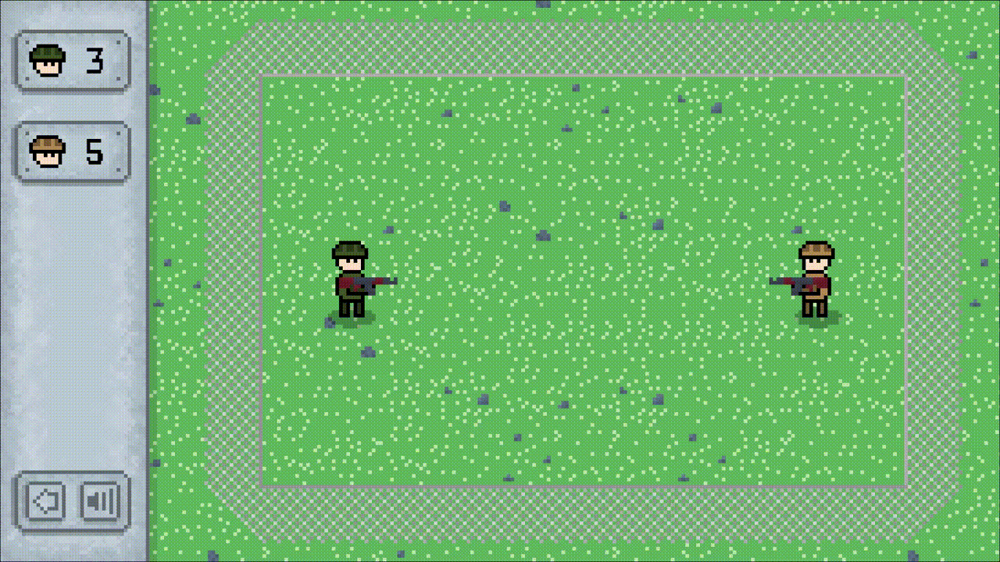

# RunOrGun

> - **Жанр:** казуальная игра на двоих
> - **Дата создания:** февраль 2026

<a href="https://cluttermultiname.itch.io/runorgun" style="font-size: 200%;">Itch.io</a>

<a href="https://github.com/Multiname/RunOrGun" style="font-size: 200%;">Репозиторий</a>

## Описание
**RunOrGun** - это игра на двоих с простым и понятным управлением: игрок может либо **бегать и уклоняться** от летящих в него снарядов, либо **остановиться**, чтобы начать **стрелять** в сторону оппонента.

Игрокам не нужно целиться, оружие **направляется на врага автоматически**. Однако стрельба имеет **разброс**, чтобы противник не мог заранее знать, куда полетит снаряд. Таким образом, сильнее тот, у кого лучше **скорость реакции**.

На данный момент в игре присутствует только одно стандартное оружие - **автомат**, стреляющий с разбросом по одному снаряду с определенной периодичностью. Планируется **развивать** проект следующими **механиками**:
1. Новое **оружие**:

    1) **Лазер** - сначала помечает линию, а затем производит моментальную атаку
    
    2) **Граната** - наносит урон по области, из которой противник должен выбежать, пока летит снаярд
    
    3) **Дробовик** - стреляет дробью, но оставляет "окно" между снарядами для уклонения
    
    4) **Снайперская винтовка** - стреляет как автомат, скорость снаряда выше, скорострельность ниже
    
2. **Ящики** - периодически появляются на карте, игроки могут собирать их, чтобы получать оружие или бонусы
3. **Укрытия** - случайно размещаются в начале раунда, блокируют снаряды, пока не разрушатся

## О разработке