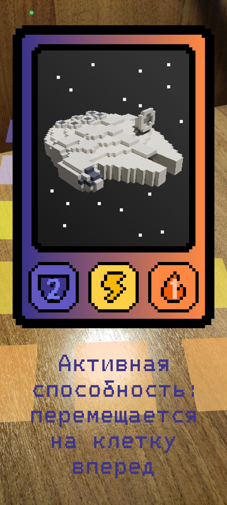
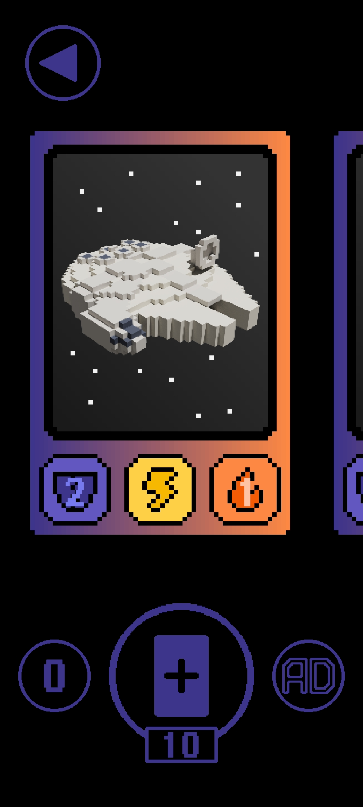

# SpaceBattleAR

> - **Жанр:** коллекционная карточная AR игра
> - **Дата создания:** май 2025

<a href="https://cluttermultiname.itch.io/spacebattlear" style="font-size: 200%;">Itch.io (мобильная и ПК версии)</a>

<a href="https://www.youtube.com/watch?v=btlhJM47Njc" style="font-size: 200%;">Демонстрационное видео</a>

<a href="https://github.com/Multiname/SpaceBattleAR" style="font-size: 200%;">Репозиторий</a>

## Описание
**SpaceBattleAR** обладает двумя **ключевыми особенностями**. Во-первых, игра использует технологию **дополненной реальности**. Во-вторых, поле, на которое сбрасываются карты, отражающие космические корабли, **разделено на клетки**, по которым затем корабли могут "ходить".

Перед началом партии игроки должны направить камеры своих смартфонов на специальную **метку**:

Корабли обладают **характеристиками** (**прочность** и **урон**) и различными **способносятми**, которые можно активировать в бою:

Партии проходят между **двумя игроками**. Игроки ходят **по очереди**. На каждом ходу игроки **получают одну карту** в руку. На своем ходу игрок может:
- **сбросить карту** на поле, призвав корабль на первом ряду,
- **совершить действия** за уже размещенные на поле корабли: **атаковать** или применить **способность**:

В начале каждого хода корабли игрока **продвигаются** на клетку вперед. **Цель** игры - занять весь **первый ряд** оппонента своими кораблями, чтобы он больше не мог сбрасывать карты.

Побеждая в партиях, игроки накапливают **валюту**, которую они могут тратить, чтобы **открывать новые карты**:

Игра проходит **по сети**. Один игрок **генерирует код**, а другой **подключается** по нему:

## О разработке