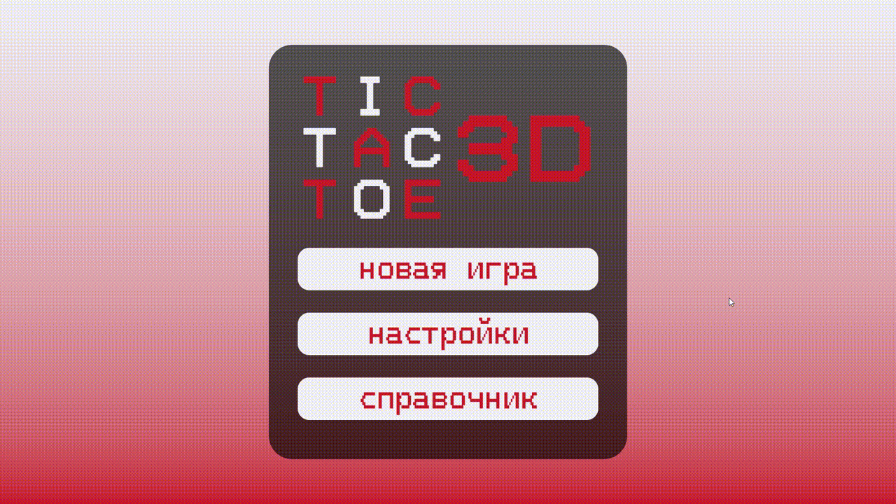
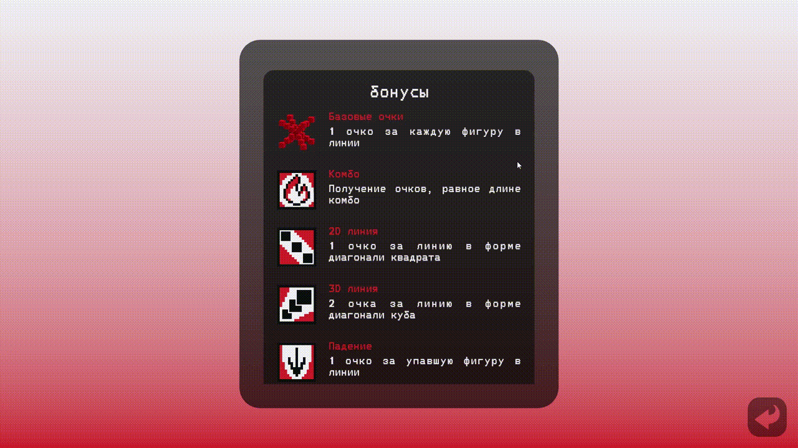
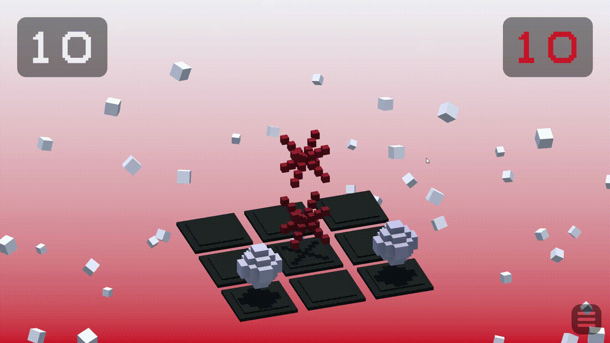
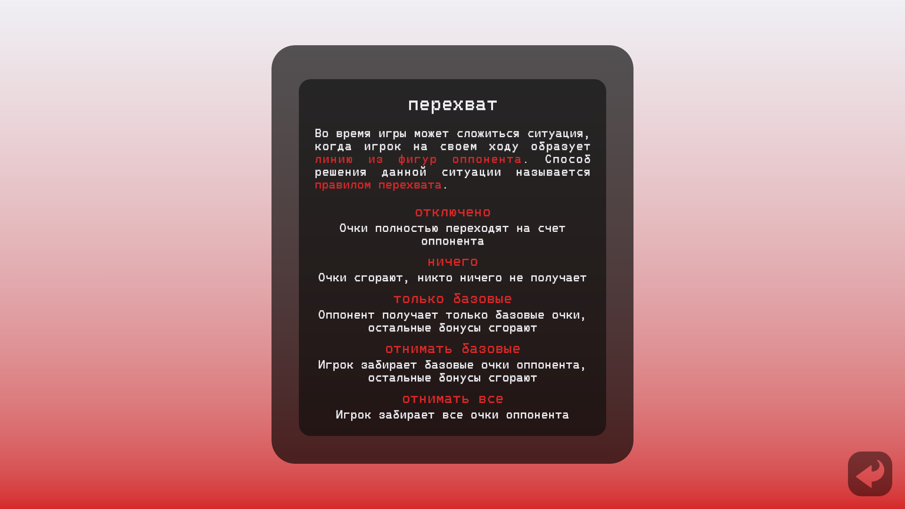
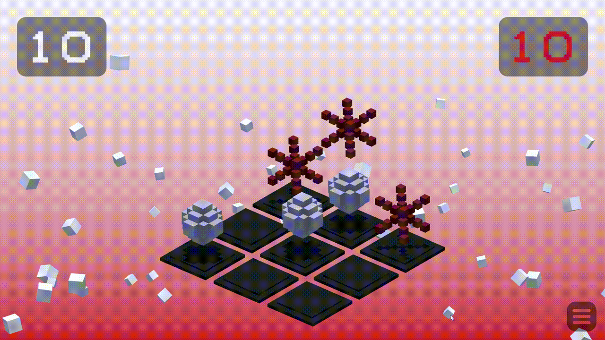

# TicTacToe3D

> - **Жанр:** казуальная игра на двоих
> - **Дата создания:** декабрь 2025

<a href="https://cluttermultiname.itch.io/tictactoe3d" style="font-size: 200%;">Itch.io (web и ПК версии)</a>

<a href="https://www.youtube.com/watch?v=gk9fO1pVdS8" style="font-size: 200%;">Демонстрационное видео</a>

<a href="https://github.com/Multiname/TicTacToe3D" style="font-size: 200%;">Репозиторий</a>

## Описание
**TicTacToe3D** - это крестики-нолики, где фигуры можно размещать не только на плоскость, но и **друг на друга**. Игроки по очереди размещают на поле свои фигуры - кресты и сферы, - пытаясь **создать линию** и не дать сделать этого своему оппоненту. Когда **3 фигуры** образуют линию, игрок **забирает** их с поля. **Побеждает** тот, кто быстрее собрал **нужное количество фигур**.

Фигуры можно ставить **сверху** или **сбоку** от другой фигуры. Если под фигурой нет другой фигуры, она **упадет**. Это может привести к **образованию новых линий**.

Чтобы сделать партии более **разнообразными**, игроки могут изменять правила игры:
- задавать **количество очков** для победы,
- переключать **бонусы**,
- настраивать правило **перехвата очков**.

**Бонусы** в основном **награждают** игрока дополнительными очками, если он **построит линию заданным образом** - например, +1 очко за фигуру в линии, если она перед этим **упала**:

Так как фигуры могут падать, игрок на своем ходу может также образовать **линию из фигур оппонента**. **Правило перехвата очков** решает, что делать в таком случае - например, начислить очки за линию не сопернику, а **себе**:

## О разработке